# Sistema de Gerenciamento de Livraria

## 📌 Descrição

Projeto de gerenciamento de estoque de uma livraria. Permite cadastrar, listar, buscar, editar, excluir e salvar livros em arquivo .txt. Conta com versões em console e interface gráfica (Tkinter), com tratamento de erros e persistência de dados.

## 🚀 Funcionalidades ao rodar o programa

✔️ Menu: Permite acesso a todas as funcionalidades do programa por meio das opções de escolha com mensagens de sucesso ou avisos. O programa executa a função correspondente e retorna ao menu após cada operação. Na versão com interface, o acesso é por meio de botões.

✔️ Adicionar Livro: Permite que o usuário adicione livros ao sistema, informando
título, autor, gênero e preço.

✔️ Listar Livros: Exibe uma lista de todos os livros cadastrados com as informações
organizadas. Quantidade total de registros e gêneros.

✔️ Buscar Livro: Permite a busca de um livro pelo título, autor ou palavra aleatória (parte do título ou autor).

✔️ Editar Informações: Permite a edição dos detalhes de um livro já cadastrado.

✔️ Excluir Livro: Remove livros do sistema.

✔️ Salvar e Carregar Dados: Permite salvar os dados (persistência dos dados) em um arquivo .txt para que possam ser recuperados posteriormente.

✔️ Carregar Dados Salvos: Permite carregar os dados de forma manual caso necessário (versão console). Ambas versões carregam os dados ao iniciar o pro gama.

## 🛠 Tecnologias Utilizadas

**Python**

**Tkinter**

**VSCode**

**Linux Mint**

## 🔗 Requisitos Técnicos

- Conceitos de programação estruturada em Python, como variáveis,
  estruturas condicionais, laços de repetição, funções, persistência dos dados e manipulação de arquivos.

- Tratamento de erros, com mensagens claras e informativas quando arquivo txt ausente, prevenir duplicação de livros com mesmo autor, tratar entradas inválidas e sucessos nas ações corretas.

## 📂 Estrutura do Projeto

```
📂 Sistema-de-Gerenciamento-de-Livraria
├── 📁 assets
├── 📁 core             					    # Lógica do backend (console)
│       │── 📄 __init__.py                     	# Lista vazia livros = []
│       │── 📁 database/				        # Funções para carregar e salvar dados backend
│       │       │──📄 salvar.py
│       │       └──📄 carregar.py
│       └── 📁 services/				        # Demais funções
│                 │──📄 cadastrar.py
│                 │──📄 exibir.py
│                 │──📄 buscar.py
│                 │──📄 editar.py
│                 └──📄 excluir.py
├── 📁 ui/                                      # Lógica do frontend (interface)
│       │── 📄 main_interface.py
│       │── 📁 database		        		    # Funções para carregar e salvar
│       │       │── 📄salvar.py
│       │       └── 📄carregar.py
│       │── 📁 services/		        	    # Demais funções
│       │       │── 📄 cadastrar.py
│       │       │── 📄 exibir.py
│       │       │── 📄 buscar.py
│       │       │── 📄 editar.py
│       │       └── 📄 excluir.py
│       └── 📁 styles/
│                 └──📄 style.py         	    # Cores e fontes
├── 📄 main.py         				            # Iniciar via console
├── 📄 run.py 					                # Iniciar via interface
├── 📄 .gitignore
└── 📄 README.md          			            # Documentação do projeto
```

## 🔧 Como Executar o Projeto

1. Clone este repositório:
   ```bash
   git clone https://github.com/Ricardo-Ottoni/Sistema-de-Gerenciamento-de-Livraria.git
   ```
2. Acesse a pasta do projeto:
   ```bash
   cd Sistema-de-Gerenciamento-de-Livraria
   ```
3. Abra o arquivo `main.py` no programa VSCode, aperte o botão `run python files` para rodar o console ou inicie o terminal e digite `python3 run.py` para rodar a interface.

## 🖥️ Demonstração – Console

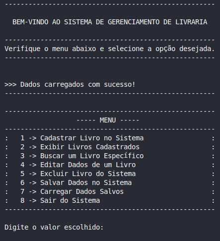


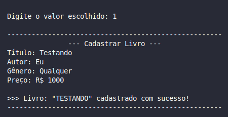

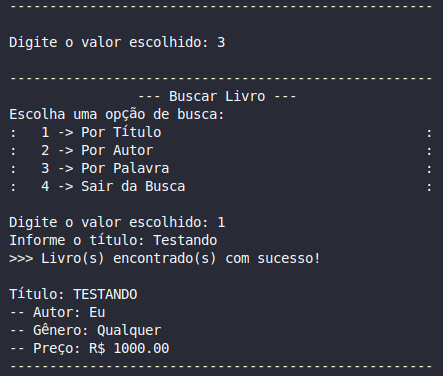

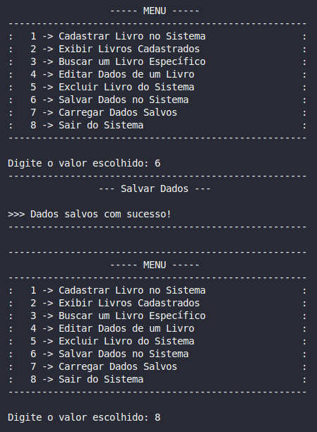

## 🖥️ Demonstração – Interface

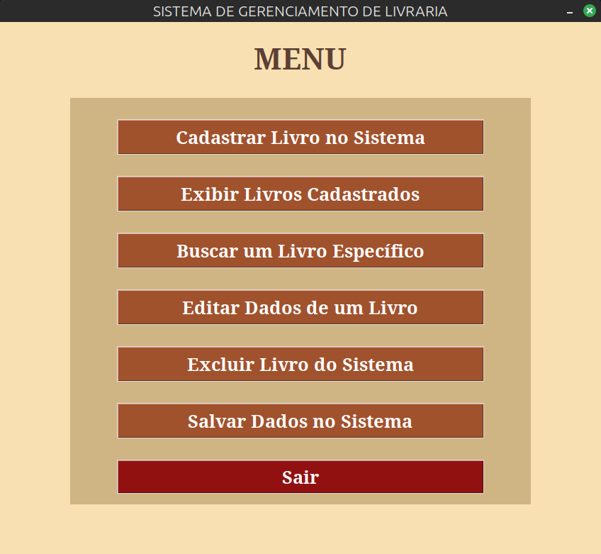

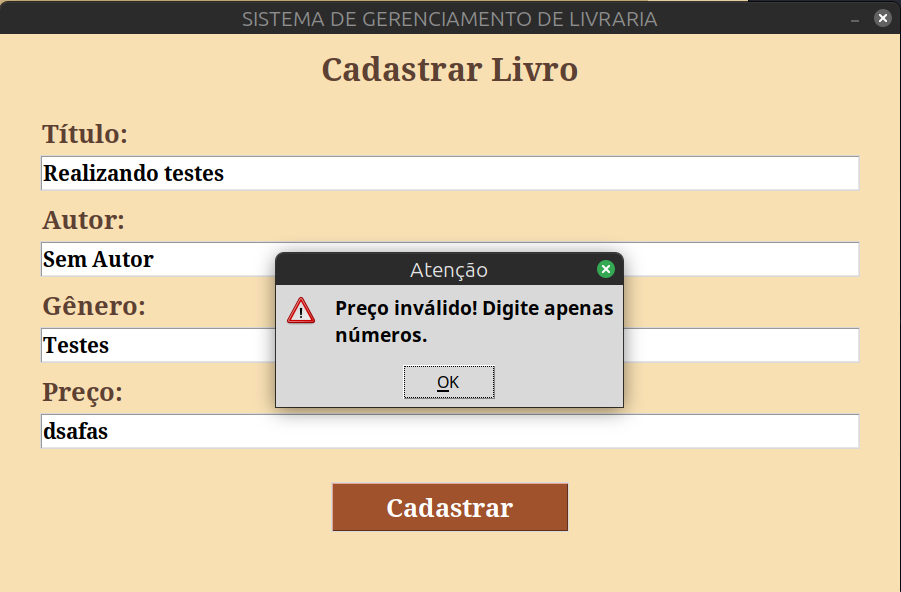

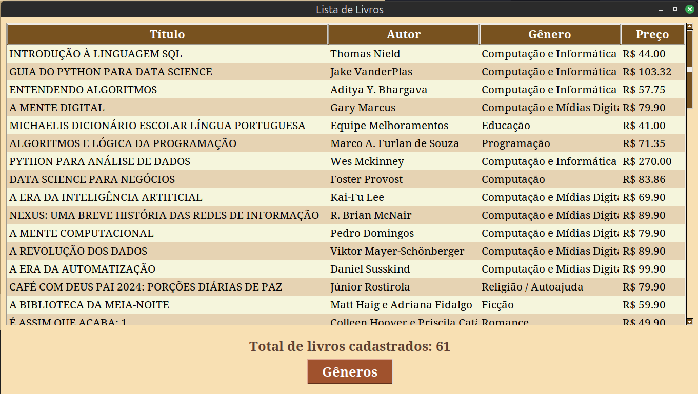

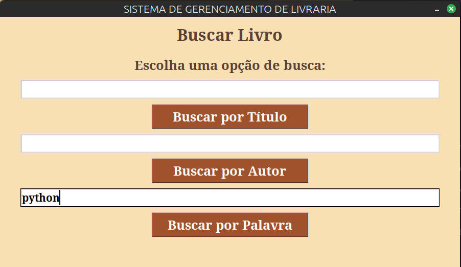

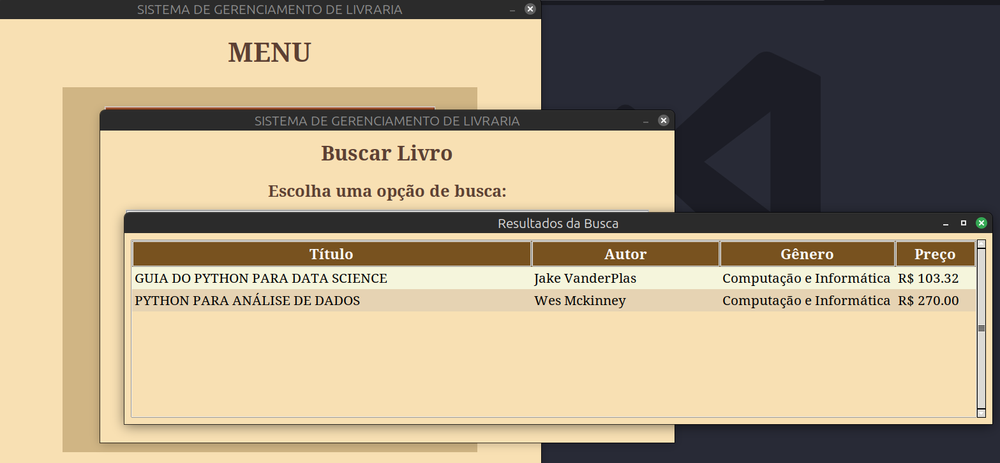

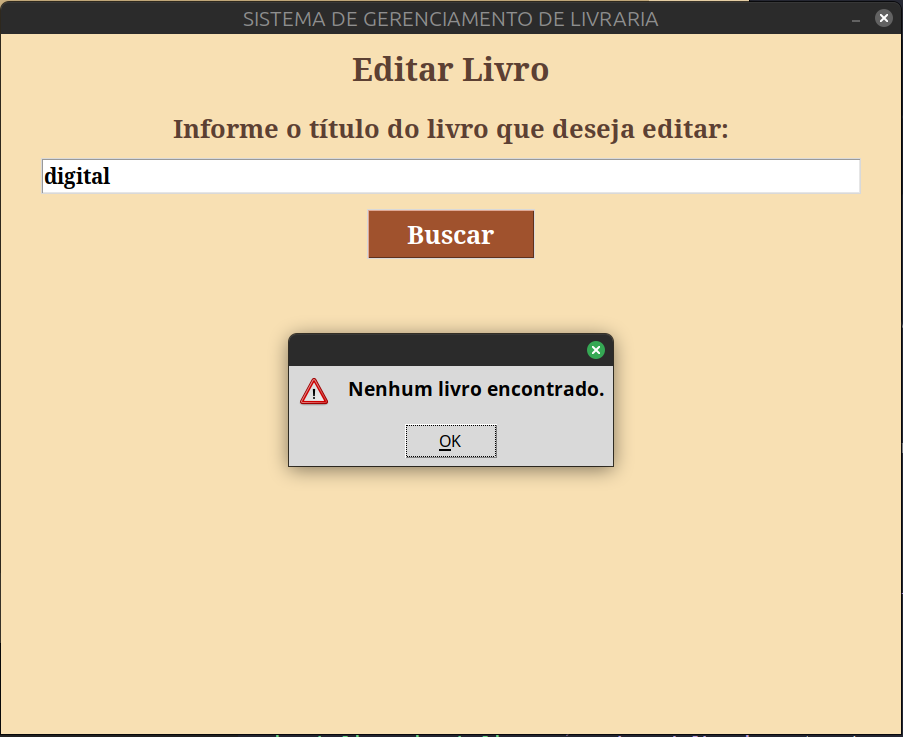

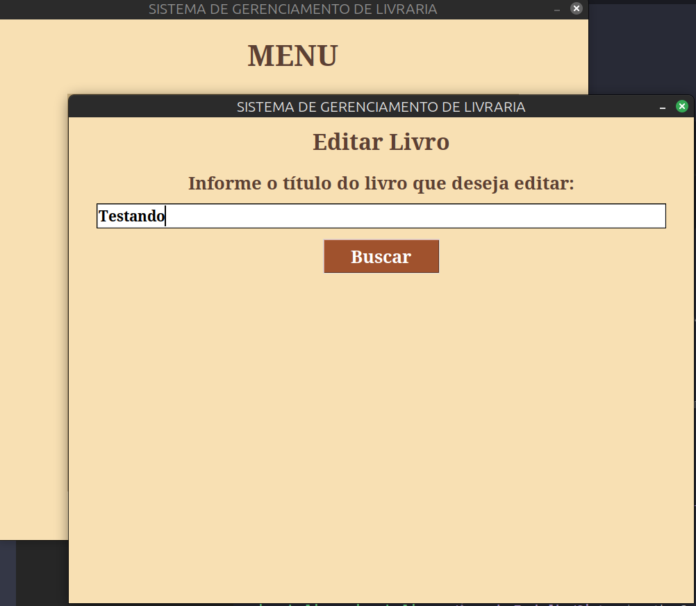

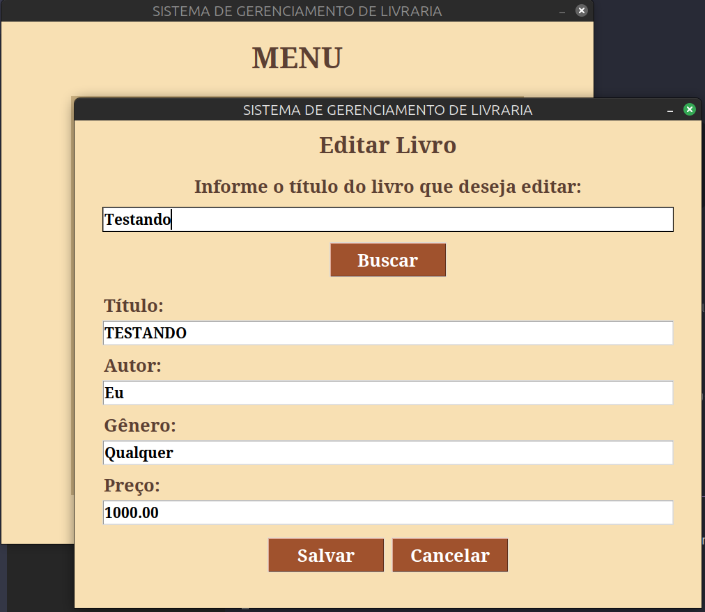

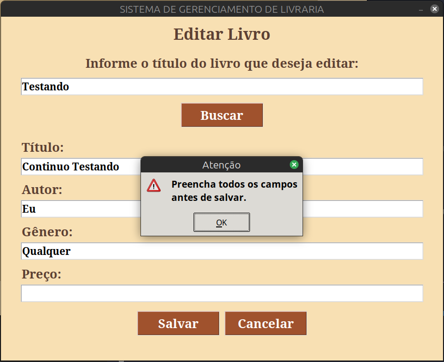

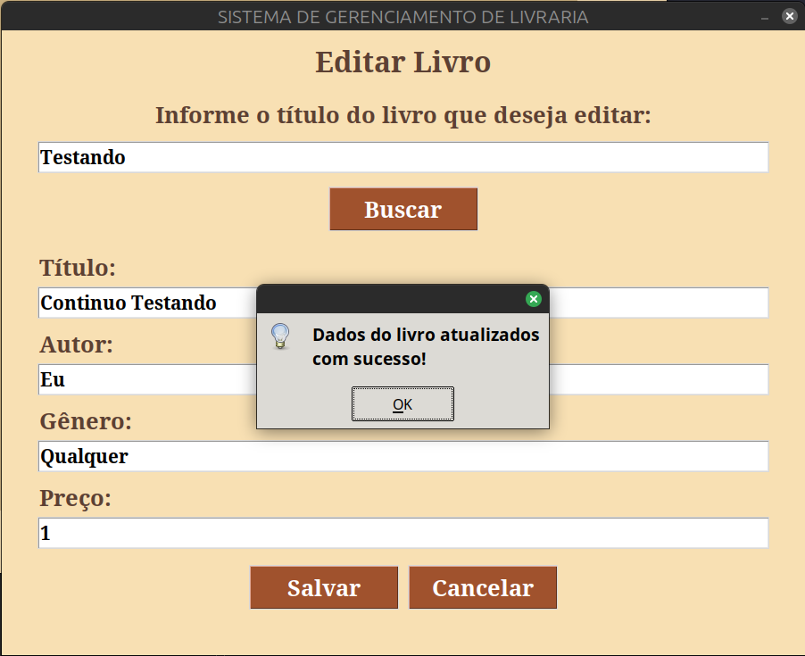

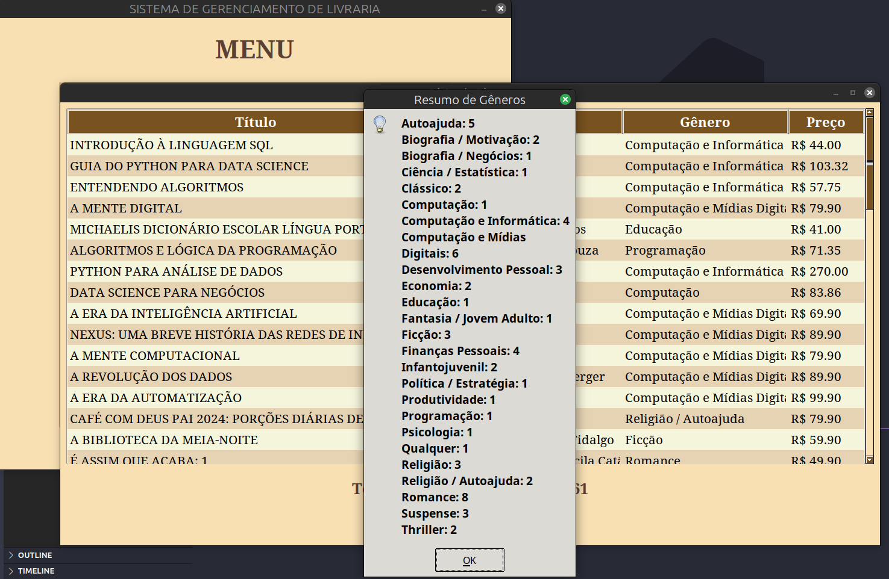

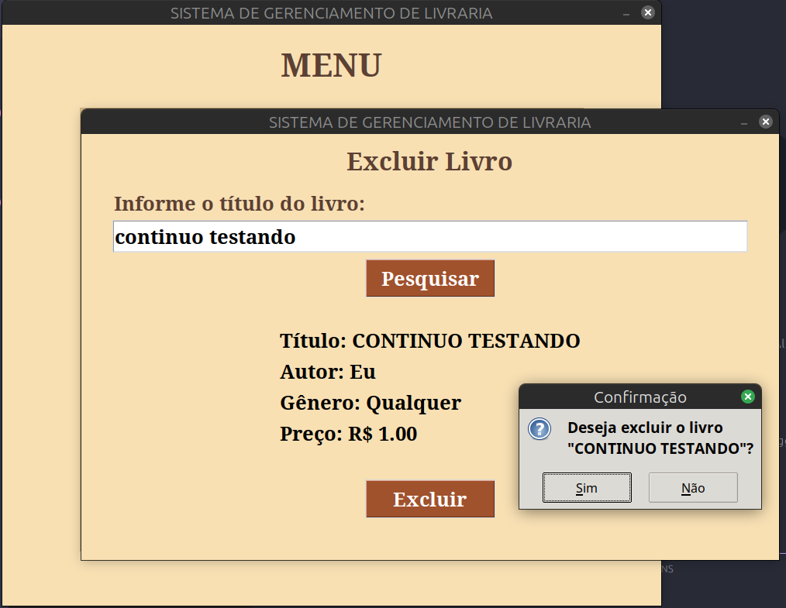

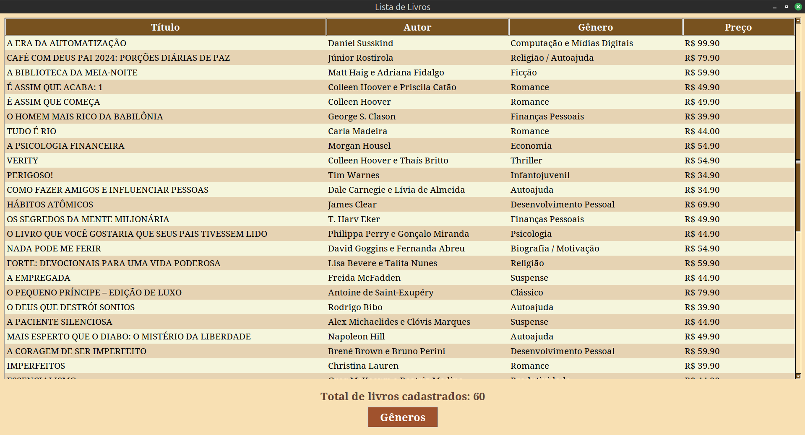

## 📚 Aprendizados

Durante o desenvolvimento deste projeto, pratiquei:

- Manipulação de arquivos `.txt` para persistência de dados.

- Uso do Tkinter para criar interfaces gráficas.

- Organização de projeto em módulos (backend e frontend).

- Tratamento de erros e validações de entrada.

- Controle de versão com Git e GitHub.
